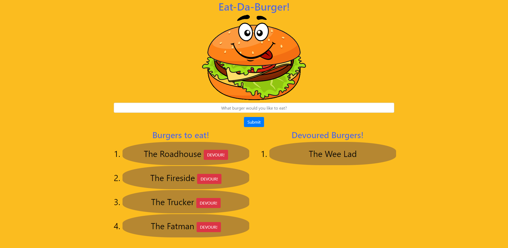

   
   
   
   
   
   
  

  # Welcome to 'Eat Da Burger!'

  ## Table of Contents

  * [Description](#Description)
  * [Demonstration](#Demonstration)
  * [Setup](#Setup)
  * [Usage](#Usage)
  * [License](#License)
  * [Contributions](#Contributions)
  * [Version](#Version)
  * [Tests](#Tests)
  * [Questions](#Questions)

  ## Description

  This application demonstrates the basic functionality of using a database with a hosted web application. The functionality covers reading, writing and updating entries in a database. The technologies used are html, CSS, jquery, node, handlebars and express. The application is deployed on Heroku using their hosted database 'JawsDB'.

  ## Demonstration

  Access the live application [here](https://lit-chamber-58185.herokuapp.com/).

  #### A screenshot of the generated web page

  

  ## Setup

  No installation is necessary. Just follow the url to use the hosted application.

  ## Usage

  Enter the burger that you would like to eat and click DEVOUR! to devour it (virtually).

  ## License

  

  You may utilize this application under the terms of the [MIT license](assets/licences/MIT.txt).

  ## Contributions

  If you would like to add new features, make improvements or bug fixes, please make a pull request. I will review it and merge it into the application as necessary.

  ## Version

  

  ## Tests

  No tests are currently available.

  ## Questions

  If you have further questions or would like to see more features, please contact me via github or email:

  https://github.com/bdcoelho 

  ben_coelho@hotmail.com
  
  ## Comments
  View this and other projects on my portfolio [here](https://bdcoelho.github.io/web-dev.html).

  
